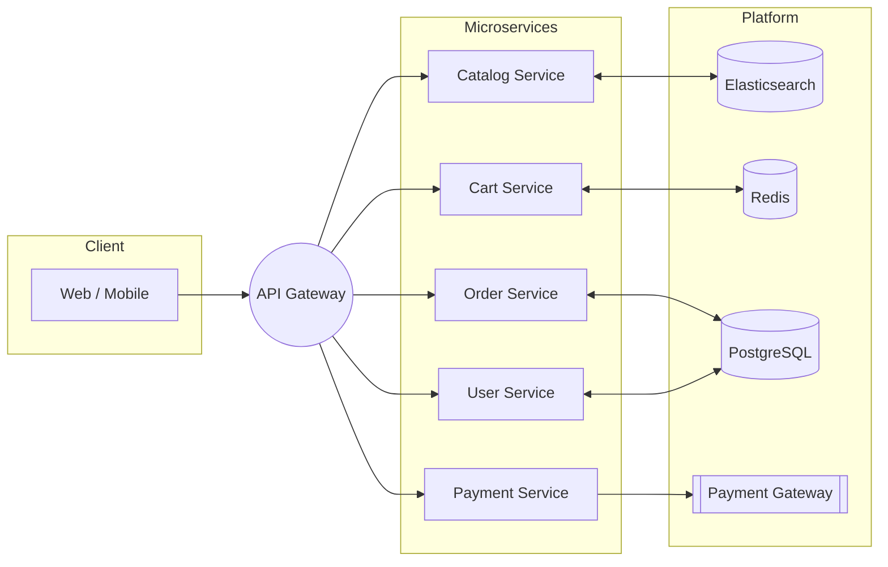

## CloudShop

CloudShop is a cloud-native e-commerce platform designed for scalability, reliability, and developer productivity. The repository is organized as a multi-language, microservices-based system supporting Node.js, Python, Java, and Go services.

### Key Features
- **Cloud-native microservices** with clear contracts and independent deployability
- **Polyglot support** (Node.js, Python, Java, Go) per team/service preference
- **Event-driven** interactions, asynchronous processing, and resilient workflows
- **Observability first**: logs, metrics, traces ready to be integrated
- **Secure by default**: secrets via environment variables and least-privilege principles

### Monorepo Layout (high-level)
- `services/` – all microservices (to be added incrementally)
- `infrastructure/` – IaC, k8s manifests, helm charts (future)
- `docs/` – architecture and design docs (future)

---

## Quick Start

Prerequisites:
- Docker and Docker Compose
- Make (recommended for unified commands)
- VS Code Dev Containers (optional but recommended)

1) Copy environment variables and adjust values as needed:
```bash
cp .env.example .env
```

2) Start local infrastructure (databases, cache, search, mock payment gateway):
```bash
make dev
```

3) Verify services are healthy:
- Postgres: `localhost:5432`
- Redis: `localhost:6379`
- Elasticsearch: `http://localhost:9200`
- Mock Payment Gateway: `http://localhost:8080`

4) Stop and clean local environment:
```bash
make clean
```

---

## Architecture Overview

The system is composed of independently deployable microservices (to be added under `services/`) interacting via HTTP/gRPC and asynchronous messaging. Persistence is handled by PostgreSQL; caching and pub/sub via Redis; search and catalog indexing via Elasticsearch; external payments are simulated locally via a mock payment gateway.



Key architectural principles:
- **Loose coupling, strong contracts**: API schemas and events define boundaries
- **Resiliency**: retries, timeouts, circuit breakers, idempotency for external calls
- **Security**: JWT/OIDC, role-based access, encryption in transit, secrets via env vars
- **Observability**: structured logging, metrics, tracing (OTel-ready)

---

## Development

- Use the provided Dev Container (`.devcontainer/devcontainer.json`) for a consistent environment.
- Use `make dev` to start infra dependencies. Microservices will be added and started through their own processes or via compose profiles.
- Follow the guidelines in `CONTRIBUTING.md` for branching, coding standards, testing, and pull requests.

---

## License

This project is licensed under the terms of the LICENSE file in this repository.

# CloudShop
CloudShop is a modern, cloud-native e-commerce platform designed to showcase best-in-class DevSecOps practices using containerized n-tier architecture. This application demonstrates the complete software delivery lifecycle, including continuous integration, continuous delivery, infrastructure provisioning, security testing, feature management, and cloud cost optimization - all capabilities that align with the Harness platform’s comprehensive approach to modern software delivery.

The application serves as an ideal reference implementation for organizations seeking to accelerate innovation velocity, drive continuous quality and resilience, secure and govern software delivery, and optimize cloud costs and engineering processes
